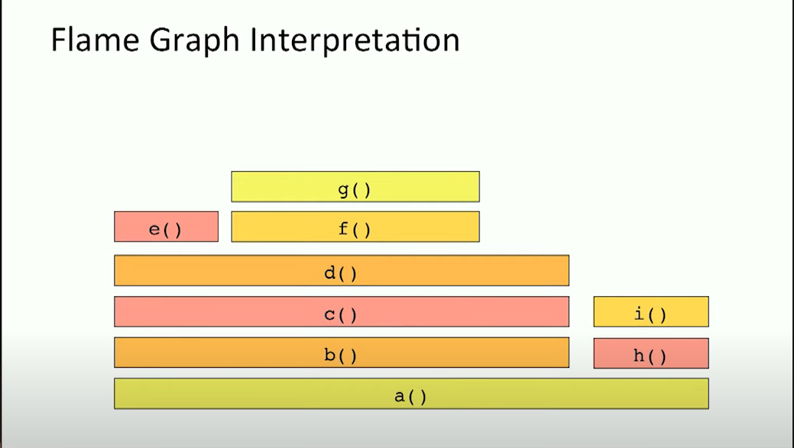

### Interesting:

- Flame graphs don't show sequentiality. They are not sorted based on time. They are sorted by alphabets. Which means in the flame graphs, if

eg.

here, the function `h()` was not run after `b()`. it's after `b()` because it's alphabetically after `h()` 

- the colours can either be random or provide another dimension (eg. sys calls in red)

- Inlining code, makes it difficult to do debugging. JAVA has options to Inline code 9 levels deep. Which means we just make it impossible to debug. Inlining is a compiler optimisation
- JIT languages are hard to keep track of.

### Resources:

- https://brendangregg.com/FlameGraphs/cpuflamegraphs.html