# ch4 : Processes

<ins>The problem</ins>: How to create the illusion of many CPUs when, we only have few.

done by running one process and pausing and running another and so on. This is called __time sharing__.

#### time sharing
- allows users to run as many concurrent processes as the user likes
- Distributes resources equally for processes.

#### space share
- processes use shared space eg. harddisk space

#### what is a process?
- An abstraction provided by the OS.
- inventory of tge different pieces of hte system it accesses

Address space?  the memory that the process can address

__Program counter/ Instruction pointer__ ? Points Which instruction of the program willl execute next.

__Stackpointer and function pointer__ ? Used to manage the stack for function parameters

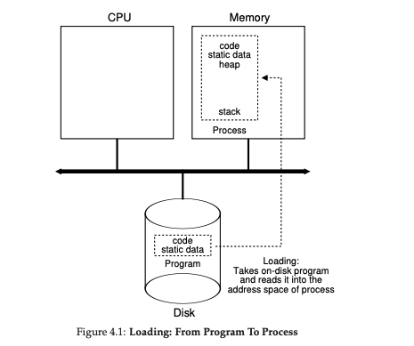

When code executes all the manipulated objects are kept in memory.

## Process Creation


program in disk => loaded into the address space of the process => OS reads this data, which is in an _executable format_ into memory.

__run time stack__ is created - which is used for saving function calls and their parameters.

OS allocates __Program Heap__ : used for dynamically allocated objects 

- Modern OSes can load programs lazily. i.e. only loading pieces of code/data that are required right now.
- The OS handles I/O and other stuff. There are 3 _file descriptors_ *input, output and error*


## Process States

- __Running__ - The process is executing instructions on the processor
- __Ready__ - process is ready, but the OS has decided not to run it
- __Blocked__ - The process has performed a function that makes it not ready to run until some other event takes place. eg. I/O request to disk. The process is blocked until the disk responds
- __scheduled__ - process is _ready to run_
- __descheduled__ - process is _moved from running to ready_

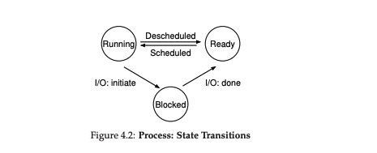


#### Process list:
To keep track of  al the processus running

xv6 proc structure

```
struct context {

int eip;
int esp;
int ebx;
int ecx;
int edx;
int esi;
int edi;
int ebp;

};

//The differe states a process can be in 

enum proc_state ( UNUSED, EMBRYO, SLEEPING, RUNNABLE, RUNNING, ZOMBIE ) ;

struct proc {

    char *mem;  //start of process memory
    uint sz; //size of process memory
    char *kstack; //Bottom of kernel stack
                  //for this process
    enum proc_state state; //Process state
    int pid;  //Process ID
    struct proc *parent;  //Parent process
    void *chan;  //If !zero, sleeping on chan
    int killed;  //If !zero, has been killed
    struct file *ofile[NOFILE];  //Open files
    struct inode *cwd;  //Current directory
    struct context context;  //switch here to run process
    struct trapframe *tf;   //Trap frame for hte current interrupt
```

When a process is stopped, its registers iwll be saved t this memory location; by restoring these registers.

procedure state is more than the 3 discussed above.

- __ZOMBIE__ state - When a process has been exited but not cleaned up.


# ch5; Process API

<ins> The Problem </ins>: What interfaces should the OS provide to create and control functionality

code is present at  [https://github.com/remzi-arpacidusseau/ostep-code/tree/master/cpu-api](https://github.com/remzi-arpacidusseau/ostep-code/tree/master/cpu-api)

### `fork()`

the `fork()` syscall is used to create a new process.

The parent process creates a sub process and the sub process starts from the point where the `fork()` call is done

run `p1.c` to get a better idea of what happens
The address space and memory are newly established

### `wait()`

The wait call makes it easier to control processes
makes a process wait for a certain time.

### `exec()`

Useful when _a program has to run a different program_


### Process control

There are other signals that are used to control processes


control-c => SIGINT - Signal interrup to the process. Thus terminating it

control-z => SIGSTP - Signal stop to stop the process so that it can be continued

kill => arbitrarily kill a process

# ch6: Limited Direct Execution

limited direct execution is a method of sharing resources. By allowing the direct execution of programs.

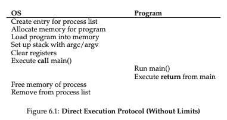

The Direct execution protocol given above

<ins>new problem</ins>: how to make sure that the process that is being "executed directly" doesn't take over the whole operating system? i.e. __Restricted opration

This solved by having a different _processor modes_. programs are usually run on what is called as __user mode__;  code that runs in user mode is restricted in what it can do. eg. in user mode programs cannot issue I/O requests; if created, it would raise an exception.

To issue I/O operations, hardwares expose some key functionailities. Operating systems provide a few hundred calls. (eg. POSIX standard). 

to execute a system call a __trap__ instruction is executed. when done the instruction _jumps into the kernel and raises the privilege to kernel mode_. When, finished, the OS calls a return-from-trap instruction which returns into the user mode.

__how does the trap know which code to run inside the OS?__ The calling process cannot specify the address. If it did then a program can just execute any arbitrary code by moving the execution pointer to the desired place.

The kernel handles this by making a __trap table__ at boot time. When the machine boots up, it does so in privileged (kernel) mode. Then, it configures the hardware that is needed and what code needs to run where. for stuff like hardware and keyboard. The OS informs these hardwares about __trap handlers__

__trap table__ is a priveleged part of the program which requires specific access to execute. If the hardware notices that the trap table is being modified by an unprivileged program, then the program is stopped


<ins>The problem: </ins> Switching between processes

In LDE, how can the OS interrupt another process, when OS is _not_ running at all, but the process it.

#### Approach 1: Wait for sys calls (Cooperative approach)

Used in older systems. The OS _expects_ the program to __behave reasonably__

These systems transfer the ownership of the processor between the OS and themselves often. This is done by the explicit `yield` sys call. Applicaitions also transfer ownership when they do something illegal, eg. seg fault


#### Approach 2: The Os takes control (non-cooperative approach)

in the cooperative approach when a process gets stuck in an infinite loop. The only recourse is to restart the system.

One way to handle is to use a __timer interrupt__. A timer device can be used to raise an interrupt to a program every few milliseconds; When the interrupt is raised, the current process is halted, and a pre-configured interrupt handler in the Os runs.

The OS should to inform the hardware which code to run, when the interrupt occurs. And setting up the timer is a privileged instruction. Once, the timer has begun the can be sure that, control will eventually be returned to it.

### Saving and REstoring context

When the OS regains control via sys call/timer interrupt. A decision has to ne made on _whether to contine the current process, or switch to a different one_. this decision is made by a __scheduler__

_Switching_ 

- if the decision is to switch. Then a __context switch__ code is executed. This saves all the general purpose regcer, PC, and the kernel stack pointer of the currently runing process and the restore them to the kernel stack. By switching stacks, the kernel switches code and runs a different program

This is a typical direct execution done for systems.

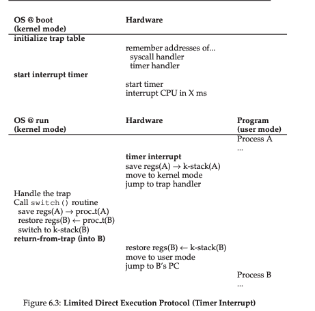


# ch7: CPU Scheduling

<ins>The problem:</ins> Develop scheduling policies

<ins>Assumptions</ins> some assumptions going in:

- Each job runs for the same amount of time
- All jobs arrive at the same time.
- Once started, each job runs to completion
- All jobs only use the CPU (i.e no I/O)
- The run-time of each job is known

These assumptions are required to simplify the decision making process. We eventually will relax the rules one by one to arrive at a solution.


#### Scheduling Metrics

__turnaround time__ - The time at which the job completes vs the time at which the job arrived


T<sub>turnaround</sub> = T<sub>completion</sub> - T<sub>arrival</sub>


Since we assumed all jobs arrive at the same time T<sub>arrival</sub> = 0 and hence T<sub>turnaround</sub> = T<sub>completion</sub>.

#### First In, First Out (FIFO)

The simplest algorithm is, FIFO. This would lead to a solution like this.

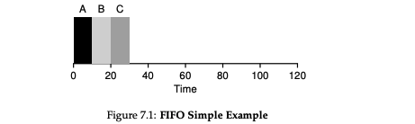

Now, lets try to loose our first assumption `Each job runs for the same amount of time`. In this case how would the worst performance look like?

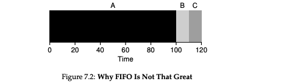

We schedule something and it's hogging up resources while the simpler ones are waiting

#### Shortest Job First (SJF)

Since we have the assumption that `The run-time of each job is known`. we can schedule jobs based on how long they run

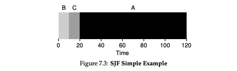

With our assumption, we can prove that SJF if the most optimal solution.

We'll try relaxing another assumption `All jobs arrive at the same time.`
Which means, A arrives at t=0 and needs to run for 100s, whereas B and C arrive at t = 0 and each run for 10 seconds.

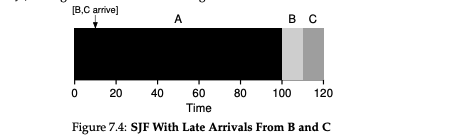

#### Shortest Time-to-Completion First (STCF):

To accomodate losing assumption 2, we can relax assumption 3 as well, `Once started, each job runs to completion.` 

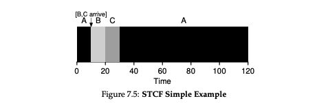

Here we are stopping process A and then letting C run and then rerunning A. This is provably optimal as well.


#### Adding new scheduling metrics

Response time

T <sub>response</sub> = T <sub>firstrun</sub> - T <sub>arrival</sub>

It is the time between the job's arrival and it's first run.


This metric can be optimised by chopping a process into pieces and starting them.

#### Round Robin

A round robin algorithm, runs a program for a time slice and then switches to another available process

The interrupt has to be a __multiple for the timer interrupt__. eg, the timer interrupt is 10 ms, then the round robin interrupt can be at 10ms, 20ms,...

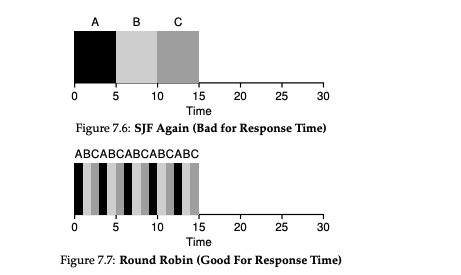

Context switching has a cost associated with it. but this can be minimised by increasing the time slice.

While RR is pretty optimal if we calculate only Response time. But, if we consider turn around time as well, then it is pretty awful considering that all the programs only get completed in the end.

This is the principle trade-off of a fair algorithm. being fair impacts your turn around time.

#### incorporating I/O

We'll relax assumption 4 `All jobs only use the CPU (i.e no I/O)`. The scheduler has an option when a program initiates an I/O. The CPU won't be useful when the I/O is being processed.

the scheduler also has to make a decision when the I/O completes. when that occurs an interrupt is raised and the OS runs and moves the processs tha tissued the I/O from blocked back to the ready state.

eg. 2 process A and B are running, A issues an I/O every 10 ms. and the time slice we use is 100 ms. in this case the operation looks like this.

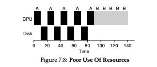

time is wasted on waiting over I/O. this can be better packed by using the wait time to run other important stuff

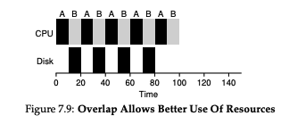

we can now remove our final assumption as well `The run-time of each job is known`. With our current scenario, we really don't need to know the run-time of each job.


# Ch8: Multi level feedback queue (MLFQ)

introduced by Corbato et al. 1962 in a system known as Compatible time sharing system.

MLFQ optimises turn around time as well as response time.

<ins>the problem</ins> How to schedule without perfect knowledge of runtime?


### MLFQ

MLFQ has a number of distinct queues, each assigned a different priority level. At any given time, a job that is ready to run is on a single queue. if multiple jobs in the queue have the same priority we just use RR to run them both

The important part of a MLFQ is the way the feedback is set.

For example in cases where there are a lot of IO calls. The feedback for the user is high and it needs to be done immediately so the priority is very high for them.

But then, If a task is doing a lot on the background and it is not immediately issuing IO then it's priority can be low.


### Attempt 1: how to change priority?

- __Rule 3__ : When a job enters the system, it is placed at the highest
priority (the topmost queue).
- __Rule 4a__ : If a job uses up an entire time slice while running, its priority is reduced (i.e., it moves down one queue).
- __Rule 4b__ : If a job gives up the CPU before the time slice is up, it stays
at the same priority level.

### Example 1: __Single long running job__


In the below example it is obvious that as a long running job runs, it's priority gets lowered slowly.

Every time it occupies resources, we slowly reduce its priority.

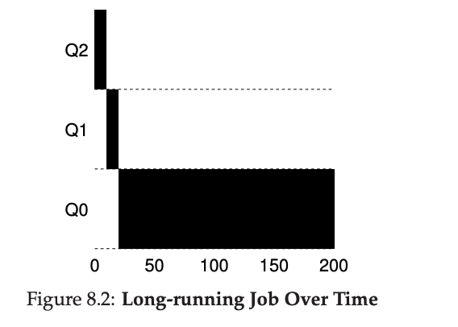

### Example 2: __A short job in between__

When a short jobs comes in between this task, then it's priority in the beginning is high, so it is given preference to run.

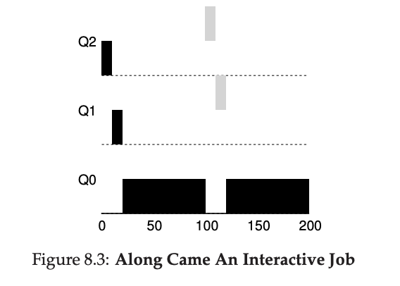


Also, when a process has a lot of IOs then its priority is kept high

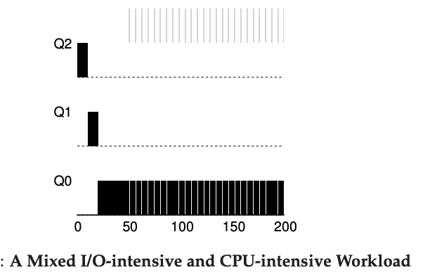

## Problems with this MLFQ implementation

If there are too many interactive processes happens then __starvation__ of CPU happens resulting in reduced resources.

A smart user could game the CPU to keep the process priority high by making a IOs at the very end of a process thereby keeping their priority high.
